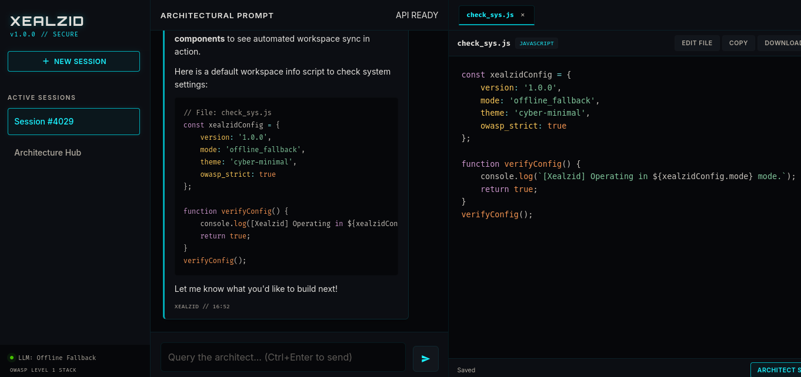

# Xealzid // Secure Code Architect Workspace

Xealzid is a production-grade, highly responsive web application designed for architectural brainstorming, code generation, and direct code editing. Built with a high-performance, cyber-minimalist dark theme, it enforces OWASP security guidelines while providing seamless integration with local LLMs (such as Ollama).



---

## ⚡ Key Features

- **Cyber-Minimal Dashboard**: Built entirely in HTML5, CSS3, and Vanilla JS for fast, frame-rate stable interactions.
- **Auto-Sync Code Workspace**: An interactive split-screen workspace featuring tabbed files, line numbers, download capabilities, clipboard copy, and direct editing.
- **Smart Markdown Extraction**: When the AI suggests code blocks in chat, Xealzid automatically extracts the blocks, parses the filenames, and updates the workspace files in real-time.
- **Context-Aware Suggestion Engine**: Includes an autocomplete suggestion engine (via `Ctrl+Space` or inline triggers like `def `, `const `, `import `) that pulls live suggestions based on file context.
- **Robust Local LLM Integration**: Designed to securely connect to a local LLM API (e.g., Ollama or Llama.cpp) with an offline mock generator fallback for zero-setup execution.
- **OWASP Hardened Security**:
  - Strict **Content Security Policy (CSP)** disabling inline scripts and `unsafe-eval`.
  - Secure **CSRF Mitigation** mapping tokens to all mutating REST requests.
  - Safe **XSS Protection** sanitizing user input and AI Markdown via local vendor copies of `DOMPurify`.
  - Traversal Prevention rejecting any file paths attempting directory traversal (`../`).

---

## 📂 Project Architecture

```
xealzid/
├── manage.py                # Command-line utility
├── requirements.txt         # Package dependencies
├── db.sqlite3               # Local SQLite database
├── xealzid/
│   ├── settings.py          # Django project settings
│   ├── urls.py              # Main URL router
│   ├── wsgi.py              # WSGI Entrypoint
│   └── asgi.py              # ASGI Entrypoint
└── core/
    ├── models.py            # ChatSession, Message, & CodeSnippet tables
    ├── views.py             # SPA renderer, REST endpoints, LLM API client
    ├── urls.py              # App-level endpoint mappings
    ├── middleware.py        # Strict security headers injector
    ├── tests.py             # Full unit and integration test suite
    ├── templates/
    │   └── core/
    │       ├── base.html    # Base skeleton, imports scripts securely
    │       └── editor.html  # Main single-page application structure
    └── static/
        ├── css/
        │   └── styles.css   # Cyber-minimal styling and responsive queries
        ├── js/
        │   └── app.js       # App logic (REST APIs, autocomplete, editor sync)
        └── vendor/
            ├── dompurify.min.js # Local offline HTML sanitizer
            ├── prism.js     # Code syntax highlighting (Markup, CSS, JS, Python)
            └── prism.css    # Tomorrow-Night style theme for code blocks
```

---

## 🚀 Quick Start

### 1. Install Dependencies
Ensure you have Python 3 and Django installed:
```bash
pip install -r requirements.txt
```

### 2. Run Database Migrations
Initialize the local SQLite database schema:
```bash
python3 manage.py migrate
```

### 3. Run the Development Server
Start the local server:
```bash
python3 manage.py runserver
```
Visit the application in your browser at `http://127.0.0.1:8000/`.

### 4. Run the Test Suite
Execute the Django unit and integration tests:
```bash
python3 manage.py test
```

---

## 🤖 Local LLM Integration Configuration

By default, Xealzid connects to a local LLM completion endpoint at `http://localhost:11434/v1/chat/completions` using the `codegemma` model (highly recommended for code architecture).

You can customize this configuration in your environment variables or directly inside `xealzid/settings.py`:

```python
# settings.py
LOCAL_LLM_URL = os.environ.get("LOCAL_LLM_URL", "http://localhost:11434/v1/chat/completions")
LOCAL_LLM_MODEL = os.environ.get("LOCAL_LLM_MODEL", "codegemma")
```

If the endpoint is offline or unavailable, the application automatically drops back to its rule-based mock generator so all editing, parsing, saving, and suggestion features can be thoroughly tested offline.
# AI-chatbot-Xealzid
